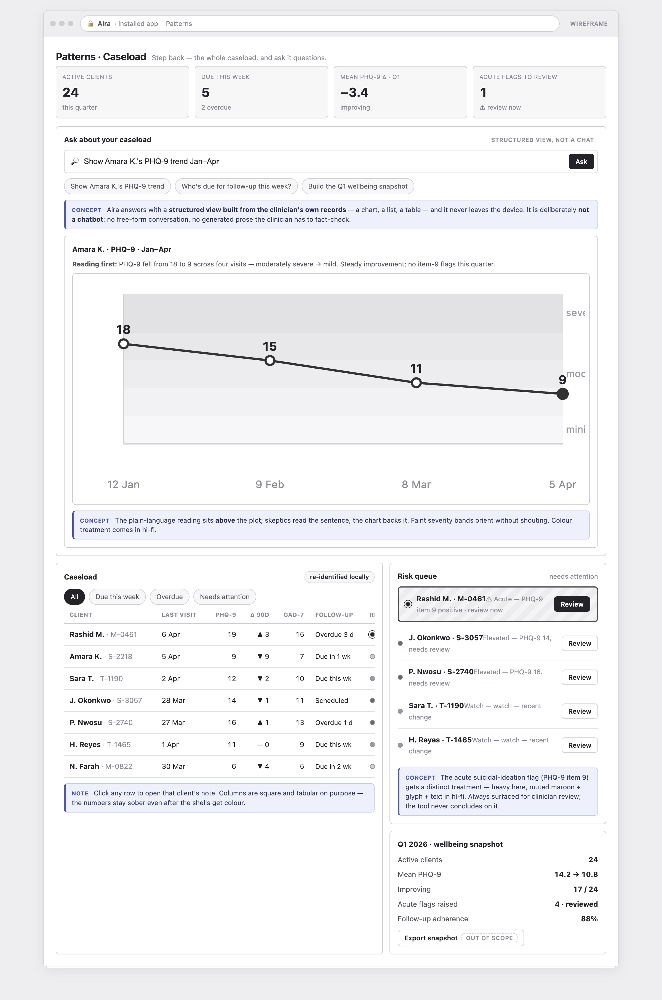
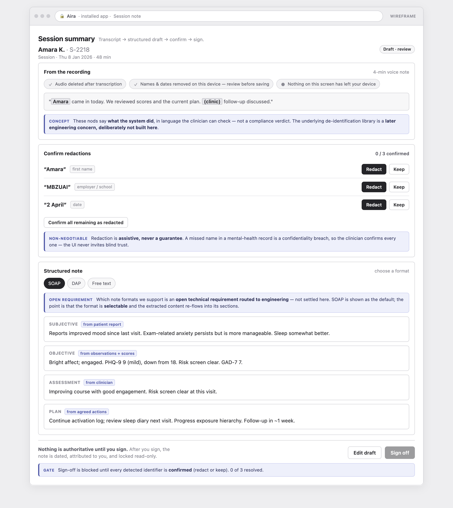

<h1 align="center" style="margin:0;">
  <picture>
    <source media="(prefers-color-scheme: dark)" srcset="docs/assets/aira-mascot-sit.png">
    <source media="(prefers-color-scheme: light)" srcset="docs/assets/aira-mascot.png">
    
  </picture>
</h1>
<h3 align="center" style="margin:0;margin-top:0;">
The counseling record that never leaves your device.
</h3>

  <a href="#what-aira-is">What it is</a> •
  <a href="#how-it-works">How it works</a> •
  <a href="#current-status">Status</a> •
  <a href="#where-to-start">Where to start</a> •
  <a href="docs/README.md">Docs</a>

 

  

<em><strong>Early wireframe, not finished UI.</strong> Near-greyscale on purpose — colour, typography, and the mascot arrive in a later hi-fi pass. These screens are still pending the captain's review; do not read them as approved design.</em>

---

## What Aira is

Aira is a **privacy-first documentation and longitudinal-insight web app for mental-health
counselors**. A counselor records what happens in their caseload, and Aira turns it into a signed
clinical note plus a picture of how each client is trending over time — PHQ-9/GAD-7/DASS scores,
follow-up adherence, risk flags, caseload rollups.

The point that makes it different: **every client record stays encrypted on the counselor's own
device, under a password only they hold, and is never uploaded.** There is **no backend at all** in
V1 — no server, no accounts, no cloud sync. The app is a static site; the data lives and dies on the
counselor's machine.

V1 is:

- an **installable web app (PWA)**, built with **SvelteKit** — installable rather than a naked
  browser tab because on-device storage on iPhone is deleted after seven idle days unless the app is
  installed to the home screen;
- **English-only** and **clinician-facing only**;
- aimed at a **solo counselor** — the first client is a counselor at **MBZUAI in Abu Dhabi**
  (launch market: UAE).

What V1 deliberately is **not** — and why — is spelled out in [`AGENTS.md`](AGENTS.md). Read that
before writing product copy or wiring up a model.

## How it works

The whole architecture follows from one invariant: **nothing leaves the device.**

- **Encrypted local vault.** Client data is encrypted under a data key that is itself wrapped by a
  key derived from the counselor's password (Argon2id envelope over AES-256-GCM). The password is
  never stored and cannot be recovered by anyone, including us. A high-entropy **recovery file**
  (with a printable copy) is the only fallback; lose both password and recovery file and the data is
  gone by design.
- **A folder the counselor owns.** The canonical source of truth is a single encrypted file in a
  folder the user creates on their own device. Browser storage is treated as a working cache behind
  a single storage-adapter interface, so the same code serves the desktop folder model and the iOS
  export/import fallback.
- **English transcription → structured draft → sign.** On a laptop, an in-browser speech model
  (Whisper-base) turns a recording into text; the audio is **deleted after transcription**. The
  transcript becomes an **editable, structured draft** (SOAP and other formats) that the counselor
  corrects and signs. **No model writes prose** — there is no in-browser LLM and no AI narration.
- **Assistive, clinician-confirmed redaction.** Detected names and dates are surfaced for the
  counselor to redact or keep before anything is saved. Redaction is an aid the clinician confirms,
  never a silent guarantee.
- **Deterministic longitudinal analysis.** The caseload insight — instrument thresholds, trajectory
  over visits, follow-up engagement, per-caseload rollups, PHQ-9 trend charts — is **plain
  arithmetic and transparent rules over the local store, with no ML.** It is auditable and runs on
  every device.

None of this needs a server, and none of it sends data anywhere. That is the product.

  

<em><strong>Early wireframe, not finished UI.</strong> The session flow: audio deleted after transcription, names and dates confirmed by the clinician, a structured draft that is nothing until signed. Still pending the captain's review.</em>

## Current status

**Scaffolding and research only — no application code yet.** This repository currently holds the
project's documentation, the settled decision records, and this scaffold. The SvelteKit app has not
been started; `src/` is an empty placeholder.

The wireframes shown above and in [`docs/`](docs/README.md) are **early, near-greyscale wireframes
still pending the captain's review.** Treat them as thinking about structure and flow, not as an
approved visual design.

## Where to start

If you are the engineer (or agent) picking this up:

1. **Read [`AGENTS.md`](AGENTS.md) first.** It carries the load-bearing architecture invariant and
   the caveats that will bite you — especially the de-identification trap. This is not optional
   reading.
2. **Read the research and decisions in [`docs/`](docs/README.md).** The
   [feasibility report](docs/reports/feasibility-stack.md) is the check on what V1 can and cannot do;
   the [decision records](docs/decisions/) are the captain's settled answers, and they are what stops
   choices being re-litigated.
3. **Build onto `src/`.** The recommended first slices (encrypted vault + PWA shell, then the
   deterministic caseload analysis) are described in the feasibility report's build sequence.

## Repository layout

| Path | What's there |
|---|---|
| [`AGENTS.md`](AGENTS.md) | Handoff document and caveats for whoever picks up the work. |
| [`docs/`](docs/README.md) | Research reports, decision records, and an index of when to read each. |
| [`docs/assets/`](docs/assets/) | Mascot art and the early wireframe screenshots used above. |
| `src/` | Placeholder for the SvelteKit app (not yet started). |
