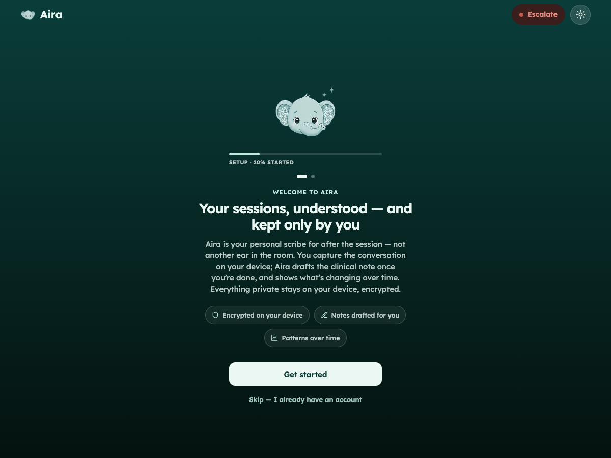
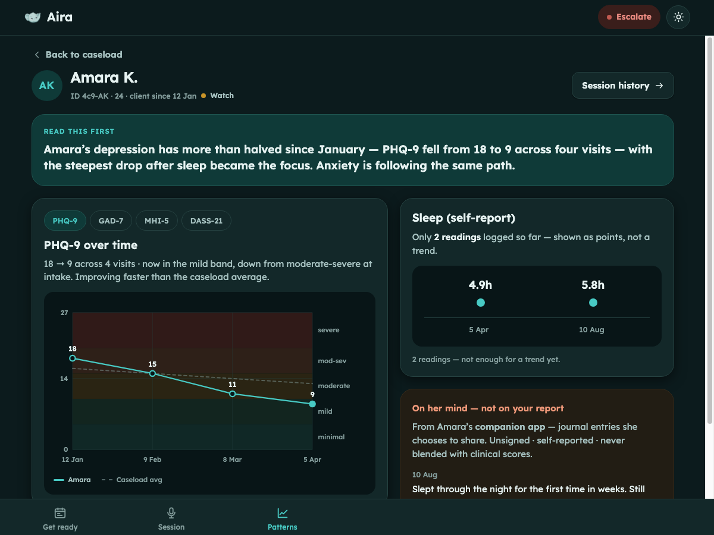
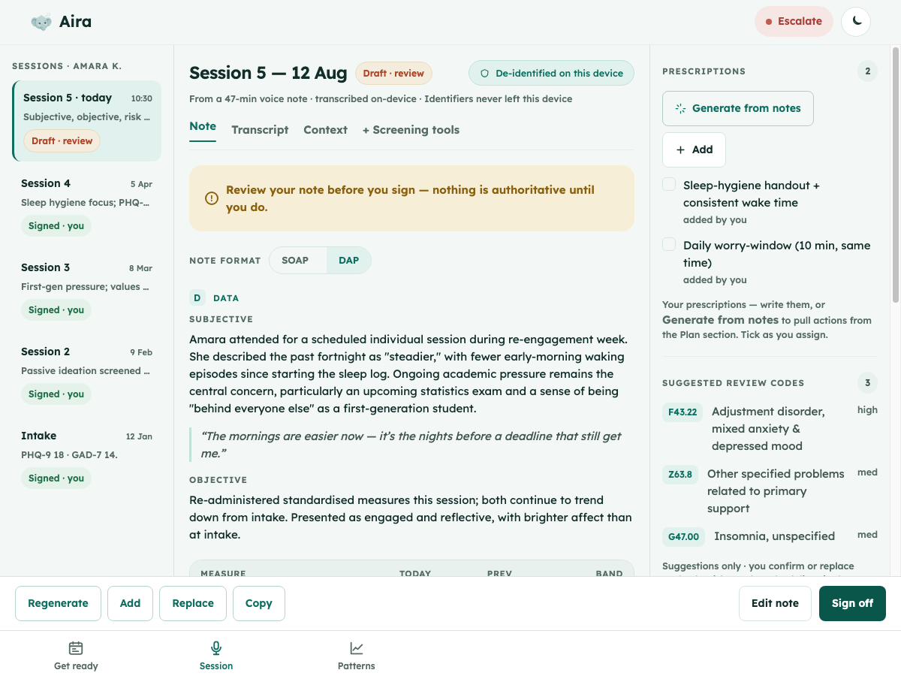

<div align="center">
  

  <h1>Aira</h1>

  <p><strong>Your sessions, understood — and kept only by you.</strong></p>

  <p>
    
    
    
  </p>
</div>

Aira is a privacy-first documentation and longitudinal-insight app for mental-health counselors: a
post-session scribe that turns a recorded session into a draft SOAP note, then surfaces
plain-language patterns across a caseload over time. Patient data stays **on the counselor's own
device**, encrypted under a password only they hold — nothing is synced to a server.

This repository is the **Expo (React Native) application** — the production app that realises the
approved click-through prototype. Expo **replaces** the earlier SvelteKit plan as *the* Aira app
(captain decision, 2026-08-12).

> **Status:** v1 foundation. Five navigable workflows with mocked services. Auth (account +
> one-time recovery code), crypto, transcription, and live data are stubbed behind interfaces
> (see [Service seams](#service-seams)). The recovery-key policy is captain-resolved
> (see [Locked v1 constraints](#locked-v1-constraints)).

<p align="center">
  
  
  
</p>

---

## What's here

Five workflows, built to the s4 prototype's steps and phone-adapted:

| Workflow | Steps |
|---|---|
| **Welcome** (boots here when signed out) | onboarding (what Aira is · what Aira does) → create account (Emirates ID + "why?", phone, name, email, password) → one-time recovery code (reveal once, copy/save, "I saved it" gate) → login |
| **Unlock** | login (username + password, "Encrypted with your login") → calm wrong-password state (inline recovery-code fallback) → decrypt transition |
| **Get ready** | day dashboard (countdown, session cards) → client drawer (scores, timeline, last plan) → read-only prep reminder → ready state |
| **Session summary** | pre-capture (read-only reminders) → recording (waveform, current-word live readout, timestamped notebox) → analysing (editable transcript) → SOAP note (S · O · Risk & Safety · A · P; three-pane on web, stacked on phone) → per-section edit/regenerate → Prescriptions rail → sign-off → audio-trust moment (delete-by-default, keep toggle) |
| **Patterns** | caseload table (search, status chips, sparklines, sober risk column) → client patterns (plain-language headline *before* charts; banded chart; sparse dot-strip rule; companion-app journal box) → history timeline → acute-risk review |

The standing calm **Escalate** affordance sits on every screen (never alarm-red, never modal — a
dismissible sheet). The **mascot** appears only on human surfaces (welcome onboarding, unlock/login,
wordmark); it is banned from charts, tables, the risk queue, and the in-session capture screen.

Rendered captures of every state (light, dark, and phone width) live in
[`docs/screenshots/`](./docs/screenshots).

---

## Architecture

The MVP's device/cloud/production split — what runs on the counselor's device, what the demo
touches, and the built-but-parked production path — is diagrammed in
[`docs/architecture.md`](./docs/architecture.md).

---

## How to run

Requires **Node ≥ 22.13** (Expo SDK 57). Install once:

```bash
npm install
```

### Web
```bash
npx expo start --web       # dev server with hot reload
# or a production static build:
npx expo export --platform web && npx expo serve
```

### Expo Go (phones)
```bash
npx expo start             # scan the QR with Expo Go (iOS/Android)
```
Everything in this v1 runs in **Expo Go** because transcription is mocked. The real on-device
whisper engine is a native module and will require a **dev build** (see [Service seams](#service-seams)).

### Native bundle check
```bash
npx tsc --noEmit                                  # type-check
npx expo export --platform ios --platform android # confirm the native bundles build
```
(An Xcode/simulator build is out of scope — not installed in the build environment.)

---

## Theme / token architecture

The design tokens are ported **verbatim** from the source-of-truth system in
`aira-ui-s3/design-direction.html` (seafoam palette derived from the mascot, Lexend type ramp,
radius 16 default / 8 xs / 22 lg / pill, elevation md default, motion fast 120 ms).

```
src/theme/
  tokens.ts          Raw token values — light + dark colour roles, radii, spacing,
                     elevation presets, motion, and the Lexend type ramp.
  ThemeProvider.tsx  React context. Follows the system colour scheme with a manual
                     override (useThemeControls().toggle). useTheme() returns the
                     resolved theme.
```

- **Colours** are semantic roles (`surface`, `elevated`, `ink`/`ink2`/`ink3`, `brand`,
  `risk`/`riskBg`, severity `band*`, …), each with a light and dark value. The WCAG-measured AA/AAA
  pairings from the s3 report carry over because the same roles land on the same surfaces.
- **Type** is consumed through `<AppText variant="…">`, bound to the ramp
  (`display`/`h1`/`h2`/`body`/`bodyStrong`/`small`/`label`/`numeric`). **Lexend** is loaded via
  `@expo-google-fonts/lexend` in the root layout.
- **Dark mode** is a full inversion of the palette; the theme toggle (top-right) pins a manual
  override over the system setting.
- Reusable primitives live in `src/components/ui.tsx` (`Card`, `Button`, `Chip`, `Badge`,
  `RiskDot`, `TrustPill`, `Avatar`, …); the mascot, auth surface, highlights, charts, waveform, and
  escalate sheet are their own components.

### Locked design decisions applied
- Default radius 16 (8 on buttons/inputs, 22 on hero shells, pill on chips/trust/escalate).
- Elevation `md` is the default card shadow; `sm` for nested cards, `lg` for the escalate sheet.
- Ghost buttons carry a ~30 % brand outline (not borderless).
- Motion `fast` 120 ms; mascot floats on a 5.5 s bob; reduced-motion is respected.
- Risk is **clay, never alarm-red**, and colour is never the only signal — always paired with a word.
- Sparse series (≤ 2 readings) render as a **dot-strip with no trend line** (a correctness rule).

---

## Service seams

Patient data never leaves the device. Three future foundations are stubbed behind interfaces so the
real implementations slot in without touching callers.

### Auth / session — `src/services/auth.ts`
- `AuthService` is the account + session seam in front of the vault. It models the captain-approved
  recovery-key policy with realistic in-memory state transitions
  (`none → awaiting-recovery-save → active`): account creation, the **one-time recovery code**
  (generated once, revealed once), sign-in (username + password), the calm wrong-password state, and
  the recovery-code fallback. v1 ships `MockAuthService` (the password chosen at account creation is
  accepted, in addition to the demo default `clinicvault`; anything else drives the wrong-password
  state). It delegates the actual vault open to `VaultStorage`. **No
  real crypto and no server calls** — the real impl (registry check + Argon2id envelope + server-side
  key escrow) slots in behind the same interface.

### Data / vault — `src/services/storage.ts`, `src/data/repository.ts`
- `ClientRepository` is the seam the **encrypted vault** slots behind. v1 reads typed in-memory
  fixtures (`src/data/fixtures.ts` — the Amara K. cohort + the report's fictional clients, **no real
  PHI**). A future `VaultClientRepository` implements the same interface, decrypting on read.
- `VaultStorage` is the **Argon2id-envelope** contract (unlock by password, recovery-code unlock,
  read/write, export/import). v1 ships `MockVaultStorage` (no crypto — it just flips the in-memory
  unlocked flag; acceptance is decided in `AuthService`). **Crypto is deliberately not implemented
  in this task.**

### Transcription — `src/services/transcription.ts`
Shaped to the whisper.cpp spike (`aira-whisper-spike-s5`). Transcription itself is **out of scope**;
the seam encodes the spike's decisions so `whisper.rn` slots in later:
- **One-shot, post-session** transcription — *not* streaming (naive chunking hallucinates at chunk
  boundaries). `transcribe()` resolves once with the full transcript; there is no partial callback.
- The model (`small.en`, ~465 MB) is **downloaded on first run, never bundled** (`ensureModel`).
- After ASR the transcript passes an on-device **de-identification** hop (OpenMed) before drafting.
- `whisper.rn` is a **native module — it does not run in Expo Go.** It needs `expo-dev-client` +
  `npx expo prebuild` + an EAS dev build. The app is structured for that pipeline from day one.

v1 uses `MockTranscriptionService` (mocked timing, canned transcript) so the recording/analysing
states demo end-to-end with no native module.

---

## Locked v1 constraints

- **English-only, single speaker assumed.** Clean seams left for Arabic + diarization later.
- **Local-first.** Patient data never leaves the device. All persistence routes through
  `VaultStorage` / `ClientRepository`.
- **Draft until sign-off.** No generated note is authoritative until the clinician signs; signing
  makes it read-only.
- **Recovery-key policy is captain-resolved** (`decision-recovery-key-policy`). Account creation
  collects Emirates ID + phone + name + email + password; a **one-time recovery code** is shown once
  at setup and is the self-service path if the password is forgotten. Aira additionally escrows the
  decrypt key server-side, released only on a manual, mutually-approved basis — deliberately **not**
  surfaced as a UI button. Setup framing is stern but truthful (effectively unrecoverable without
  claiming impossibility). **All** recovery + login copy is isolated in `src/strings/recovery.ts`.

### What is stubbed
| Area | Status |
|---|---|
| Auth (account creation, one-time recovery code, sign-in) | **Stubbed** — `MockAuthService`, in-memory state, no server |
| Encryption / vault (Argon2id, recovery-code unlock, export/import) | **Stubbed** — `MockVaultStorage`, no crypto |
| Transcription (whisper.rn) | **Stubbed** — `MockTranscriptionService`, mocked timing; needs a dev build |
| Live / persisted data | **Stubbed** — typed in-memory fixtures behind `ClientRepository` |
| Server-side key escrow (manual recovery path) | **Not built** — policy-only; never surfaced in UI |

---

## Project structure

```
src/
  app/                 expo-router routes
    welcome/           onboarding (intro · how) → create account → one-time recovery code
    unlock/            pre-auth: login (username + password), wrong-password, decrypt
    (app)/             authed shell (top bar + workflow tab switcher + escalate)
      today/           Get ready: dashboard → drawer → prep reminder → ready
      session/         Session summary: capture → recording → analysing → review (SOAP)
      patterns/        Patterns: caseload → client patterns → history → risk review
  components/          Mascot, auth surface, Highlights, charts, waveform, escalate sheet, ui primitives
  theme/               tokens + ThemeProvider
  data/                types, fixtures (no PHI), repository interface
  services/            auth (account/session) + storage (vault) + transcription seams
  strings/             recovery.ts (login + recovery copy, captain-resolved policy)
docs/screenshots/      rendered captures of every workflow step (light/dark/phone)
```
