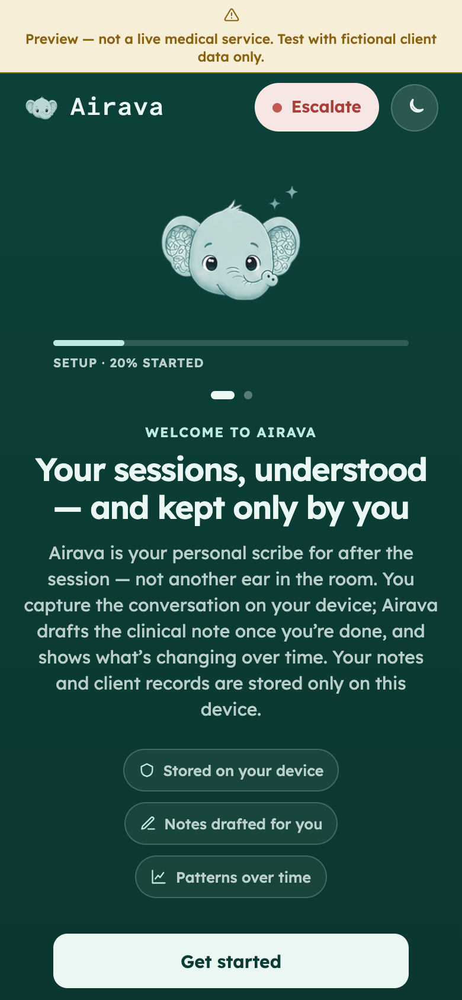
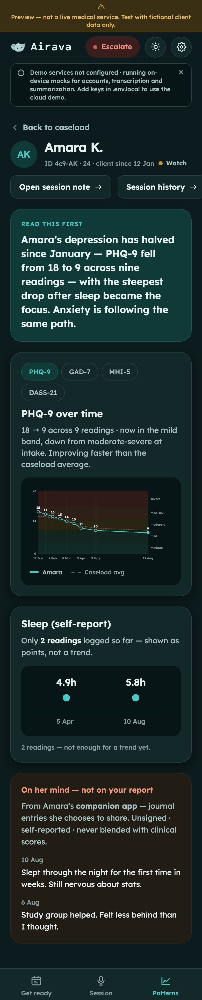
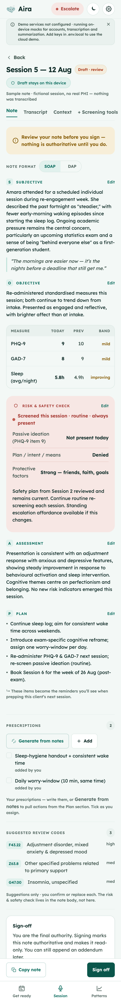

<div align="center">
  

  <h1>Airava</h1>

  <p><strong>Your sessions, understood — and kept only by you.</strong></p>

  <p>
    
    
    
  </p>
</div>

Airava is a privacy-first documentation and longitudinal-insight app for mental-health counselors: a
post-session scribe that turns a recorded session into a draft SOAP note, then surfaces
plain-language patterns across a caseload over time. Patient data stays **on the counselor's own
device**, encrypted under a password only they hold — nothing is synced to a server.

This repository is the **Expo (React Native) application** — the production app that realises the
approved click-through prototype. Expo **replaces** the earlier SvelteKit plan as *the* Airava app
(captain decision, 2026-08-12). **Airava** is the user-visible product name; the shorthand `aira`
stays for everything non-user-facing (repo, npm package, the Expo `slug`/`scheme`, the device-storage
namespace, code identifiers and paths) — see `AGENTS.md` "Name vs. slug" for why those must not be
renamed.

> **Status:** v1 foundation with a **live demo mode**. Five navigable workflows. A fresh install
> boots **blank** (zero-states everywhere; load the sample cohort from Settings). Behind the existing
> seams, accounts run against **Supabase** and transcription/summarization against **Groq**
> (whisper-large-v3 + llama-3.3-70b); with no keys the app degrades to on-device mocks. Clinical data
> stays device-local. Crypto is still stubbed. See [Demo-mode live services](#demo-mode-live-services)
> and [Service seams](#service-seams). The recovery-key policy is captain-resolved
> (see [Locked v1 constraints](#locked-v1-constraints)).

<p align="center">
  
  
  
</p>

<p align="center"><sub>Phone-dimension captures (390×844 @2×), light + dark — see <a href="docs/screenshots/mobile/"><code>docs/screenshots/mobile/</code></a>.</sub></p>

---

## What's here

Five workflows, built to the s4 prototype's steps and phone-adapted:

| Workflow | Steps |
|---|---|
| **Welcome** (boots here when signed out) | onboarding (post-session "personal scribe" framing; endowed setup progress bar, prefilled 20% → 45% → 72% → 100%) → create account (Emirates ID + "why?", phone, name, email, password) → one-time recovery code (reveal once, copy/save, "I saved it" gate) → login |
| **Unlock** | login (username + password, "Encrypted with your login", HIPAA-aligned trust note) → calm wrong-password state (inline recovery-code fallback) → decrypt transition |
| **Get ready** | day dashboard (countdown, session cards) → client drawer (scores, timeline, last plan, editable patient-details card that persists device-local, mock SALAMA/EHR connection card with a persistent no-external-system disclaimer) → read-only prep reminder → ready state |
| **Session summary** | pre-capture (read-only reminders; record, upload a clip, or use sample audio) → recording (waveform + timer, timestamp-synced comment-card strip with a dotted add-first card, trust note; transcription is one-shot on stop — no live readout) → analysing (editable transcript; a silent/near-empty capture is refused rather than drafted, and a dismissible banner flags a transcript that doesn't read like clinical text) → note with SOAP/DAP format switcher (SOAP: S · O · Risk & Safety · A · P; DAP merges S+O into one D — Data section, derived so content never diverges; three-pane on web, stacked on phone) → per-section inline edit (each section's **Done** persists through the vault seam, and an edit still open when the clinician signs is flushed into the note that gets signed) → Prescriptions rail → sign-off (attributed to the signed-in clinician, stamped when they sign) → audio-trust moment (delete-by-default, keep toggle). **Copy note** (on the draft action bar and again under the signed note, for the EHR paste) writes the whole note as plain text — draft-marked when unsigned, attested when signed — and confirms only after a real clipboard write; where the platform has no clipboard it is disabled and says why, never a silent no-op. The reviewed transcript is saved **with** the note (same device-local vault seam, same retention), and the note's **Transcript** tab shows that real text; a note with no stored transcript — sample data, or notes captured before transcripts were saved — says so plainly rather than standing in placeholder prose. Up to **3 notes per client** are retained, newest first — the session rail switches between them. |
| **Patterns** | caseload table (search, status chips, sparklines with a dashed first-reading baseline, sober risk column carried over from each note's risk tier, Outreach mailto templates that grey out once used; tiles computed from the caseload itself) → client patterns (plain-language headline *before* charts; multi-scale tabs PHQ-9 · GAD-7 · MHI-5 · DASS-21 with a muted dashed "Caseload avg" comparison stroke + legend; sparse ≤2-reading dot-strip rule kept per scale; companion-app journal box) → history timeline (with the retained notes) → acute-risk review (reachable for **any** client rated acute, including one the app flagged from a captured session; with no structured safety snapshot on file it says so and points at the session note rather than inventing one, while still offering escalation and the safety plan) → safety-plan viewer |

The standing calm **Escalate** affordance sits on every screen (never alarm-red, never modal — a
dismissible sheet). No option in it is a dead promise: it dials the configured crisis line (local
emergency services when none is set), drafts a warm-handoff mail to the on-call clinician, and opens
the client's safety plan — and where there is no client in context or a contact isn't configured, the
control says so plainly instead of sitting inert. The **mascot** (the captain's background-removed
mood set — hero moods on the welcome/login/recovery screens, a per-workflow mood beside the app-bar
wordmark, which also returns you to the day board) appears only on human surfaces; it is banned from charts, tables, the risk queue, and the in-session capture
content (see `src/components/mascotMoods.tsx`).

Rendered captures of the workflows (light + dark) live in
[`docs/screenshots/`](./docs/screenshots) — the current signature set is the phone-dimension
[`mobile/`](./docs/screenshots/mobile) captures; the earlier `r4r5-` web renders are kept alongside.

---

## Architecture

The MVP's device/cloud/production split — what runs on the counselor's device, what the demo
touches, and the built-but-parked production path — is diagrammed in
[`docs/architecture.md`](./docs/architecture.md).

---

## How to run

Requires **Node ≥ 22.13** (Expo SDK 57). Install once:

```bash
npm install
```

For the **live demo** (accounts + transcription + summarization), copy the env template and fill in
keys; without it the app runs entirely on on-device mocks (and says so):

```bash
cp .env.example .env.local   # then set EXPO_PUBLIC_SUPABASE_* and EXPO_PUBLIC_GROQ_PROXY_URL
```

`.env.local` is gitignored — never commit real keys. Only client-safe values belong in an
`EXPO_PUBLIC_*` var (they are inlined into the bundle and readable by anyone who opens the page): the
Supabase **publishable** (anon) key, and the Groq **proxy URL** (a public function endpoint). The
**Groq API key is server-side** — a Supabase secret behind the `groq-proxy` Edge Function, never a
client var. See [Groq proxy (Edge Function)](#groq-proxy-edge-function) and
[Demo-mode live services](#demo-mode-live-services).

The same template also carries the deployment's **safety contacts** — the crisis line the Escalate
sheet dials and the on-call address a warm handoff drafts to. `.env.example` documents each one and
what the app says honestly when it is left unset (it never fabricates a mental-health number).

### Web
```bash
npx expo start --web       # dev server with hot reload
# or a production static build:
npx expo export --platform web && npx expo serve
```

### Expo Go (phones)
```bash
npx expo start             # scan the QR with Expo Go (iOS/Android)
```
Everything in this v1 runs in **Expo Go** — no native module yet (demo transcription is a plain
HTTPS call to the `groq-proxy` Edge Function, or the mock). The real on-device whisper engine is a
native module and will require a **dev build** (see [Service seams](#service-seams)).

### Native bundle check
```bash
npx tsc --noEmit                                  # type-check
npx expo export --platform ios --platform android # confirm the native bundles build
```
(An Xcode/simulator build is out of scope — not installed in the build environment.)

---

## Theme / token architecture

The design tokens are ported **verbatim** from the source-of-truth system in
`aira-ui-s3/design-direction.html` (seafoam palette derived from the mascot, Lexend type ramp,
radius 16 default / 8 xs / 22 lg / pill, elevation md default, motion fast 120 ms) — except the
**dark palette**, which was revised turquoise-leaning in prototype round 4 with contrast
re-measured (source: `aira-ui-screens-s4/revision-4-notes.md`; values in `src/theme/tokens.ts`).

```
src/theme/
  tokens.ts          Raw token values — light + dark colour roles, radii, spacing,
                     elevation presets, motion, the Lexend type ramp, and the
                     wordmark-only `brandFont`.
  ThemeProvider.tsx  React context. Follows the system colour scheme with a manual
                     override (useThemeControls().toggle). useTheme() returns the
                     resolved theme.
```

- **Colours** are semantic roles (`surface`, `elevated`, `ink`/`ink2`/`ink3`, `brand`,
  `risk`/`riskBg`, severity `band*`, …), each with a light and dark value. The WCAG-measured AA/AAA
  pairings from the s3 report carry over for light; the round-4 dark values were re-measured (every
  text pairing meets AA/AAA).
- **Type** is consumed through `<AppText variant="…">`, bound to the ramp
  (`display`/`h1`/`h2`/`body`/`bodyStrong`/`small`/`label`/`numeric`). **Lexend** is loaded via
  `@expo-google-fonts/lexend` in the root layout. The wordmark — and only the wordmark — renders in
  the `brandFont` token (`theme.brandFont` = Atkinson Hyperlegible Mono Medium, a local asset in
  `assets/fonts/` with its Braille Institute license, loaded through the same `useFonts` call);
  interface text never uses it. Web metadata Expo's static export doesn't emit is declared by hand:
  the `<title>` via a root `Head` in `_layout.tsx`, and `public/manifest.json` linked from
  `src/app/+html.tsx` (which also carries the `theme-color`, read from the `brand` token).
- **Dark mode** is a full parallel palette (turquoise-leaning since round 4); the theme toggle
  (top-right) pins a manual override over the system setting.
- Reusable primitives live in `src/components/ui.tsx` (`Card`, `Button`, `Chip`, `Badge`,
  `RiskDot`, `TrustPill`, `Avatar`, …); the mascot, auth surface, highlights, charts, waveform, and
  escalate sheet are their own components.

### Locked design decisions applied
- Default radius 16 (8 on buttons/inputs, 22 on hero shells, pill on chips/trust/escalate).
- Elevation `md` is the default card shadow; `sm` for nested cards, `lg` for the escalate sheet.
- Ghost buttons carry a ~30 % brand outline (not borderless).
- Motion `fast` 120 ms; mascot floats on a 5.5 s bob; reduced-motion is respected.
- Risk is **clay, never alarm-red**, and colour is never the only signal — always paired with a word.
- Sparse series (≤ 2 readings) render as a **dot-strip with no trend line** (a correctness rule).

---

## Demo-mode live services

Clinical data always stays on the device. The seams below are wired to **real cloud services for the
demo**, and each degrades to its on-device mock when its keys are absent (a calm banner + Settings row
report which are live). Configuration is `EXPO_PUBLIC_*` in `.env.local`, read via `src/config/env.ts`.

| Concern | Live (keys present) | Mock (no keys) |
|---|---|---|
| **Accounts** | Supabase `signUp` / `signInWithPassword` (`SupabaseAuthService`). Email confirmation OFF; Emirates ID/phone/name → user metadata. The one-time recovery code stays app-side (local vault key). | `MockAuthService` |
| **Transcription** | Groq **whisper-large-v3** over recorded/uploaded audio (`GroqTranscriptionService`), via the `groq-proxy` Edge Function. Web capture via MediaRecorder + a file-picker fallback (`services/audioCapture.ts`). | `MockTranscriptionService` (canned transcript) |
| **Summarization** | Groq **llama-3.3-70b** → SOAP sections + risk/safety + plan → `DraftNote` (`services/summarization.ts`), via the `groq-proxy` Edge Function. | `MockSummarizationService` |

Both Groq calls go through a **server-side proxy** so the Groq API key never ships in the bundle —
see [Groq proxy (Edge Function)](#groq-proxy-edge-function). Transcription + summarization are two
**separate cloud hops** over the session — the audio to
transcribe, then the transcript text to draft from — and the demo banner says so plainly so the
on-device trust copy never overclaims. Each is recorded on the note as it happens (a capture can stay
on-device, e.g. the sample audio, and still be drafted in the cloud), so the note's source line and
Transcript tab report what actually happened to *that* note rather than how the app is configured
when it is read back. Notes, transcripts and prescriptions still persist **device-local** behind the
vault seam.

**Blank boot.** A fresh install starts EMPTY — no clients, zero-states everywhere. Caseload state is a
reactive context (`src/data/DataProvider.tsx`) persisted through `ClientRepository` → `VaultStorage`
(`LocalVaultStorage` → `deviceStore`: localStorage on web, a JSON file on native). Load the Amara
sample cohort from **Settings → Load sample data** (or the zero-state CTA); clear it there too.

### Groq proxy (Edge Function)

The Groq API key is **server-side**: it lives as a Supabase **secret** behind the `groq-proxy` Edge
Function (`supabase/functions/groq-proxy/index.ts`), never as an `EXPO_PUBLIC_*` var. `EXPO_PUBLIC_*`
values are inlined into the web/native bundle at build time — an `EXPO_PUBLIC_GROQ_API_KEY` would be
readable by anyone who opens the page, letting anyone spend the project's Groq quota. The app now
holds only the **proxy URL** (`EXPO_PUBLIC_GROQ_PROXY_URL`, a public function endpoint) and calls it
with the signed-in counselor's Supabase **session token**.

The function proxies both Groq calls — `POST /groq-proxy/transcriptions` (multipart audio →
whisper-large-v3) and `POST /groq-proxy/chat/completions` (JSON messages → llama-3.3-70b) — and:

- **Verifies the caller.** The `Authorization: Bearer` must be a valid *user* session JWT (role
  `authenticated` and not an anonymous sign-in, checked against GoTrue `/auth/v1/user`). Anonymous
  callers and the anon publishable key are rejected **401** — only signed-in counselors spend quota.
  (`verify_jwt` is disabled in `supabase/config.toml` on purpose: we verify in-code so the anon key —
  itself a valid JWT — is rejected and errors come back as clear JSON.)
  *What this does **not** prove, stated plainly:* signup is open from the client with the public anon
  key and email confirmation is **OFF**, so a valid user JWT proves **"someone registered"**, not
  **"an authorized counselor"**. Real signup restriction — an allowlist or a custom claim check —
  defers to production/Azure; for the demo the pinned models and the rate limit are what bound the
  damage a registered stranger can do.
- **Reads `GROQ_API_KEY` from the function environment** (a Supabase secret), never from a client var.
- **Pins the models server-side.** `whisper-large-v3` for transcription, `llama-3.3-70b-versatile` for
  chat; a caller-supplied `model` is **overwritten, not honoured**, so no one can aim the project's
  quota at an arbitrary, more expensive Groq model.
- **Rate-limits per caller.** A best-effort **in-memory fixed window** (default 20 req / 60 s per user
  id; tune with `RATE_LIMIT_MAX` / `RATE_LIMIT_WINDOW_MS`). *Honest limits:* the counter lives in the
  isolate's memory, so it is per-isolate and resets on cold start — an abuse backstop, **not** a hard
  cluster-wide quota. A hard limit needs a shared store (a Postgres table with an atomic upsert, or
  Redis); that is the production upgrade.
- **Guards identifiers.** Any payload carrying a client/patient identifier or name (a set of forbidden
  JSON keys / form fields — `clientName`, `client_id`, `mrn`, …) is rejected **400** with a clear
  error, never silently stripped — a server-side backing for "identifiers never leave the device".
- **Passes upstream Groq errors through faithfully** (status code + body preserved, plus `Retry-After`
  and `x-ratelimit-*` so a caller can actually back off — those are CORS-exposed for browser callers).

**Honest degradation — the line it draws.** *Fabrication* is the app **inventing clinical text**:
standing a canned transcript in for a session that was actually recorded. That is never acceptable.
*Drafting the clinician's own typed or pasted words on-device* invents nothing, and is the accepted
no-keys degradation. The two seams therefore behave differently on purpose:

| | no proxy configured | proxy configured, **no live session** |
|---|---|---|
| **Transcription** | on-device mock (nothing was recorded to misrepresent) | **rejects** — never a canned transcript for a real recording |
| **Drafting** | on-device mock, full demo note | on-device mock in **`deriveOnly`** mode, stamped `draftedInCloud: false` |

So the paste-the-transcript recovery is a **real, working route to a note**: type or paste the
session text and Airava drafts it on this device, with nothing sent anywhere. It never crashes.

`deriveOnly` matters because that fallback runs over a **real** session. The stub restates only what
the clinician's own words support — subjective, objective, and the conservative risk scan — and leaves
the assessment, plan, prescriptions and diagnosis codes as *"review required"*. It never attaches a
working diagnosis or prescriptions nobody derived from the session, and the note's source line says a
**keyword stub** wrote it so "drafted on this device" is not mistaken for an on-device model. The
unconfigured no-keys demo, which runs over the canned sample and documents nobody, keeps its complete
walkthrough note.

**Provenance records three separate facts**, each from what actually happened rather than from
build-time config, because they come apart:

- `audioLeftDevice` — the recording was **uploaded**. True from the moment the POST is issued, since a
  429 or 5xx arrives *after* the audio has left. Never under-disclosed.
- `transcriptFromCloud` — the stored text **is** what whisper returned. True only on a successful
  cloud transcription, so text the clinician typed after a failed upload is never presented as a
  machine transcript a reader might later audit for mishearings.
- `draftedInCloud` — stamped by the summarizer that actually produced the draft.

Because the proxy authenticates with the Supabase session, Groq features require Supabase accounts to
be configured too (`hasGroq = hasSupabase && proxy URL set`).

**A live email/password session is what unlocks the cloud — recovery-code unlock is not.** This is a
deliberate consequence of the recovery-key model, not a bug. Signing in with email + password
(`authService.signIn` → Supabase `signInWithPassword`) is the only path that mints a session token,
and that token is what the proxy verifies. **Recovery-code unlock opens the local vault but not the
cloud**: it holds no Supabase credentials and cannot mint a session by design — the whole point of
the recovery code is that it never carries the account password. The same applies after a native app
reload, where the session is kept in memory only (`persistSession` is web-only in
`src/services/supabase.ts`).

The capture screen handles that **before** the mic opens: on entering it checks for a live session
(`cloudSessionReady`) and, when there isn't one, says so plainly and offers to sign in first — an
informed choice, never a gate on recording. If a session is recorded anyway, the transcription
rejection explains the position honestly, including the part that is easy to over-promise: signing in
enables cloud transcription for the **next** capture and **cannot** transcribe the recording already
made (leaving the screen discards it). The working path for the capture in hand is to paste the
transcript and draft on-device.

**Residency.** Supabase Edge Functions run on Supabase's **global edge** (Deno Deploy), not
necessarily in-region; this project is **ap-south-1 (Mumbai)**. For production the **same proxy
pattern moves to the in-region Azure container** (see [`infra/`](infra/)), keeping the key server-side
*and* the hop in-region.

**Deploy.**

```bash
export SUPABASE_ACCESS_TOKEN=…                       # a Supabase CLI access token
supabase link --project-ref <project-ref>            # run inside this repo (writes supabase/.temp/, gitignored)
supabase secrets set GROQ_API_KEY=gsk_…              # the Groq key — server-side secret, not a client var
supabase functions deploy groq-proxy                 # deploy the function
```

Then set `EXPO_PUBLIC_GROQ_PROXY_URL` in `.env.local` to
`https://<project-ref>.supabase.co/functions/v1/groq-proxy`. Verify with a signed-in session token:

```bash
# 200 + a completion (signed-in counselor)
curl -s -X POST "$PROXY/chat/completions" -H "Authorization: Bearer $USER_JWT" \
  -H "Content-Type: application/json" \
  -d '{"model":"llama-3.3-70b-versatile","messages":[{"role":"user","content":"ping"}]}'
# 401 (anonymous — no bearer, or the anon publishable key)
curl -s -X POST "$PROXY/chat/completions" -H "Content-Type: application/json" \
  -d '{"model":"llama-3.3-70b-versatile","messages":[{"role":"user","content":"ping"}]}'
```

## Service seams

Patient data never leaves the device. These foundations sit behind interfaces so implementations slot
in without touching callers (see live wiring above; crypto is still a mock).

### Auth / session — `src/services/auth.ts`
- `AuthService` is the account + session seam in front of the vault. It models the captain-approved
  recovery-key policy through the state transitions
  (`none → awaiting-recovery-save → active`): account creation, the **one-time recovery code**
  (generated once, revealed once), sign-in (username + password), the calm wrong-password state, and
  the recovery-code fallback. The code itself is never kept — a non-cryptographic **hash** of it is
  persisted device-locally at account creation (alongside the clinician's name and email), so the
  saved code still unlocks after a reload and the sign-off is attributed to whoever actually signed
  in. Login prefills only that persisted email — never a demo identity, and never a password. With
  Supabase configured the app uses `SupabaseAuthService` (see
  [Demo-mode live services](#demo-mode-live-services)); otherwise `MockAuthService` (the password
  chosen at account creation is accepted, in addition to the demo default `clinicvault`; anything
  else drives the wrong-password state — no crypto, no server calls). Either way the actual vault
  open is delegated to `VaultStorage` and the recovery code stays app-side. The whole `(app)` group
  renders only while that vault is open, so signing out — or simply reloading — bounces back to
  unlock instead of showing the caseload. The production impl (registry check + Argon2id envelope +
  server-side key escrow) slots in behind the same interface.

### Data / vault — `src/services/storage.ts`, `src/data/repository.ts`
- `ClientRepository` is the seam the **encrypted vault** slots behind. `VaultClientRepository`
  loads/saves the whole caseload snapshot through `VaultStorage`; a fresh install is blank, and the
  Amara K. sample cohort (`src/data/fixtures.ts` — **no real PHI**) loads on demand from Settings.
  Screens read through the reactive hooks in `src/data/DataProvider.tsx`, never fixtures directly.
- `VaultStorage` is the **Argon2id-envelope** contract (unlock by password, recovery-code unlock,
  read/write, export/import). v1 ships `LocalVaultStorage`: still **no crypto** (plaintext blobs;
  acceptance is decided in `AuthService`), but records now persist device-locally through
  `deviceStore` (localStorage on web, a JSON file on native). The real Argon2id vault encrypts
  these same blobs behind the same interface.

### Transcription — `src/services/transcription.ts`
Shaped to the whisper.cpp spike (`aira-whisper-spike-s5`). **On-device** transcription itself is
out of scope for v1; the seam encodes the spike's decisions so `whisper.rn` slots in later:
- **One-shot, post-session** transcription — *not* streaming (naive chunking hallucinates at chunk
  boundaries). `transcribe()` resolves once with the full transcript; there is no partial callback.
- The model (`small.en`, ~465 MB) is **downloaded on first run, never bundled** (`ensureModel`).
- After ASR the transcript passes an on-device **de-identification** hop (OpenMed) before drafting.
- `whisper.rn` is a **native module — it does not run in Expo Go.** It needs `expo-dev-client` +
  `npx expo prebuild` + an EAS dev build. The app is structured for that pipeline from day one.

With Groq configured the app uses `GroqTranscriptionService` — a disclosed **cloud hop** through the
[`groq-proxy` Edge Function](#groq-proxy-edge-function) (see
[Demo-mode live services](#demo-mode-live-services)); note the on-device de-identification hop does
**not** run in demo mode. Otherwise `MockTranscriptionService` (mocked timing, canned transcript)
drives the recording/analysing states. Neither needs a native module.

---

## Locked v1 constraints

- **English-only, single speaker assumed.** Clean seams left for Arabic + diarization later.
- **Local-first.** Patient data never leaves the device. All persistence routes through
  `VaultStorage` / `ClientRepository`.
- **Draft until sign-off.** No generated note is authoritative until the clinician signs; signing
  makes it read-only.
- **Recovery-key policy is captain-resolved** (`decision-recovery-key-policy`). Account creation
  collects Emirates ID + phone + name + email + password; a **one-time recovery code** is shown once
  at setup and is the self-service path if the password is forgotten. Airava additionally escrows the
  decrypt key server-side, released only on a manual, mutually-approved basis — deliberately **not**
  surfaced as a UI button. Setup framing is stern but truthful (effectively unrecoverable without
  claiming impossibility). **All** recovery + login copy is isolated in `src/strings/recovery.ts`.

### What is live vs stubbed
| Area | Status |
|---|---|
| Auth (account creation, sign-in) | **Live (demo)** — Supabase when configured, else `MockAuthService`. One-time recovery code stays app-side, verified against a device-local hash so it survives reloads. |
| Transcription | **Live (demo)** — Groq whisper-large-v3 when configured, else `MockTranscriptionService`. |
| Summarization → SOAP draft | **Live (demo)** — Groq llama-3.3-70b when configured, else `MockSummarizationService`. |
| Persisted data | **Device-local** — reactive store behind `ClientRepository` → `VaultStorage`; blank on first boot. |
| Encryption / vault crypto (Argon2id, recovery-code unlock, export/import) | **Stubbed** — `LocalVaultStorage` persists plaintext blobs; no crypto yet. |
| Server-side key escrow (manual recovery path) | **Not built** — policy-only; never surfaced in UI |

---

## Project structure

```
src/
  app/                 expo-router routes
    welcome/           onboarding (intro · how) → create account → one-time recovery code
    unlock/            pre-auth: login (username + password), wrong-password, decrypt
    (app)/             authed shell (top bar + workflow tab switcher + escalate)
      today/           Get ready: dashboard → drawer → prep reminder → ready
      session/         Session summary: capture → recording → analysing → review (SOAP)
      patterns/        Patterns: caseload → client patterns → history → risk review → safety plan
      settings/        demo-services status, load sample data / clear all data, sign out
  components/          mascot moods (mascotMoods), auth surface, DemoBanner, ZeroState, Highlights, charts, waveform, escalate sheet, ui primitives
  config/              env.ts (EXPO_PUBLIC_* + hasSupabase/hasGroq flags, crisis line / on-call contacts)
  theme/               tokens + ThemeProvider
  data/                types, sample fixtures (no PHI), assessment scales, repository + reactive DataProvider
  services/            auth (Supabase/mock), storage (vault) + deviceStore, transcription + summarization (Groq/mock), audio capture, writeQueue (serialized snapshot saves)
  strings/             recovery.ts (login + recovery copy, captain-resolved policy)
scripts/               dependency-free invariant harnesses (`node scripts/<name>.mjs`)
docs/screenshots/      rendered captures of every workflow step (light/dark/phone)
```
