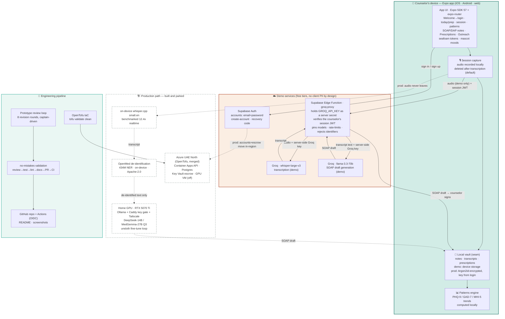

# Aira — MVP architecture

Everything the MVP touches, from the counselor's voice to the signed note. Solid boxes run today
(demo); dashed are the committed production path. Data that identifies a client never crosses the
dotted privacy line.

- 🟩 **on the counselor's device**
- 🟧 **demo cloud (free tiers)**
- ⬜ **production path (built, not live)**
- 🟦 **engineering pipeline**

**The one rule the diagram encodes:** identity lives with Supabase (and later Azure UAE), thinking
happens wherever the model runs (Groq today, your GPU or Azure tomorrow), but **what the client
said and what the counselor signed exists only on the device**. Demo mode's honest exceptions are the
two Groq hops the diagram shows — the audio to transcribe, then the transcript text to draft from —
and neither one talks to Groq directly: both go through the `groq-proxy` Edge Function, which holds
the Groq key server-side and only serves a signed-in counselor. Both hops are temporary and labeled
in-app on the note itself, and they disappear as transcription moves on-device and drafting moves to
the parked production path.
